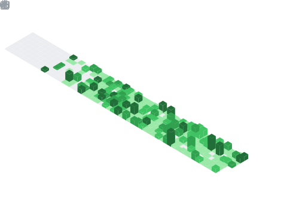

# 💫 About Me, I'm Mohd Harish:
👋 Hey there! 
I'm a 2nd-year B.Tech Computer Science student at Galgotias University. 

🚀 I'm an aspiring Software Engineer with a passion for building impactful and innovative software projects. 

💻 Currently diving into Open Source contributions and continuously honing my development skills — one project at a time. 

  
  &nbsp;&nbsp;
  

## 🌐 Socials:

<a href="https://www.mohdharish.xyz">
  <h5>My Portfolio Webiste</h5></img>
</a>  

      

# 💻 Tech Stack:
                             
# 📊 GitHub Stats:
 
 

## 🏆 GitHub Trophies

### ✍️ Quote

### 🔝 Top Contributed Repo

---

